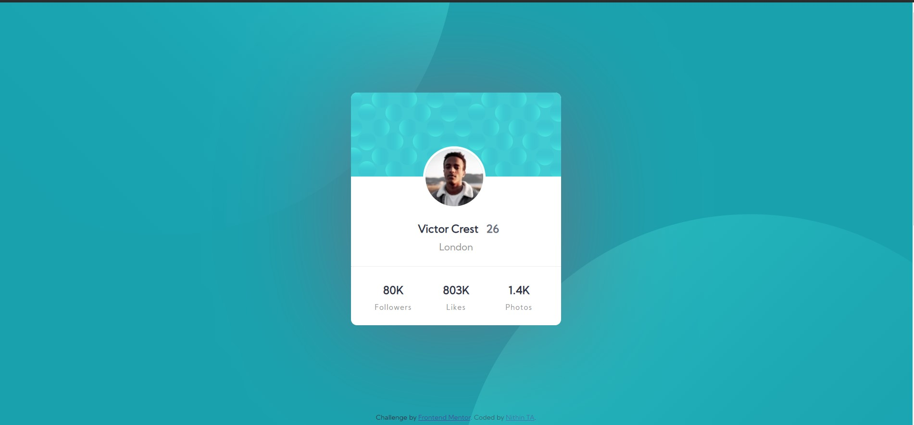

# Frontend Mentor - Profile card component solution

This is a solution to the [Profile card component challenge on Frontend Mentor](https://www.frontendmentor.io/challenges/profile-card-component-cfArpWshJ). Frontend Mentor challenges help you improve your coding skills by building realistic projects. 

## Table of contents

- [Overview](#overview)
  - [The challenge](#the-challenge)
  - [Screenshot](#screenshot)
  - [Links](#links)
- [My process](#my-process)
  - [Built with](#built-with)
  - [What I learned](#what-i-learned)
  - [Continued development](#continued-development)
  - [Useful resources](#useful-resources)
- [Author](#author)
- [Acknowledgments](#acknowledgments)


## Overview
- This was a challenge to complete the frontend of a profile card using **html** and **css**


### The challenge

- Build out the project to the designs provided

<hr>

### Screenshots
    
#### My Desigh ✌



#### Prefered Design 👀


### Links

- Solution URL: [My solution](https://github.com/Nithin47TA/profile-card-component-main)
- Live Site URL: [My site](https://nithin47ta.github.io/profile-card-component-main)


### Built with

- HTML5 markup
- CSS 


### What I learned

 This is a relatively simple task for newbie web developers so there is not much of a take away i just needed to refresh my css and html 
 


```css
.profile-card{
   position: relative;  
}


.person{
    position: absolute;
}
```
  this is something that i forgot about so i thought i will mention it, for centering the image I used **absolute** withought thinking it is affected by the `relative` position of card

### Continued development

 I am really comfortable with **css** and **html** so i would like to incoperate other technologies udsed in web development


### Useful resources

- [MDN WebDocs](https://developer.mozilla.org/en-US/) - This is one of the richest and most usefull documentation for web developers.
- [W3 Schools](https://www.w3schools.com/css/) - I used this as an introduction to web development.


## Author

- Website - [Nithin TA](https://www.your-site.com)
- Frontend Mentor - [Nithin47TA](https://www.frontendmentor.io/profile/Nithin47TA)
- GitHub - [Nithin47TA](https://github.com/Nithin47TA)
- Linkedin - [Linkedin](https://www.linkedin.com/in/nithin-ta/)

**Note: Delete this note and add/remove/edit lines above based on what links you'd like to share.**

https://nithin47ta.github.io/profile-card-component-main/